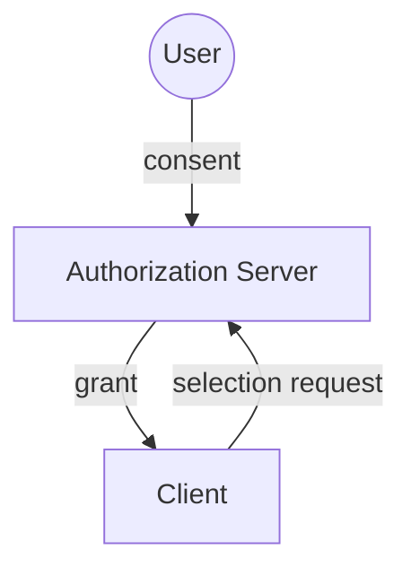
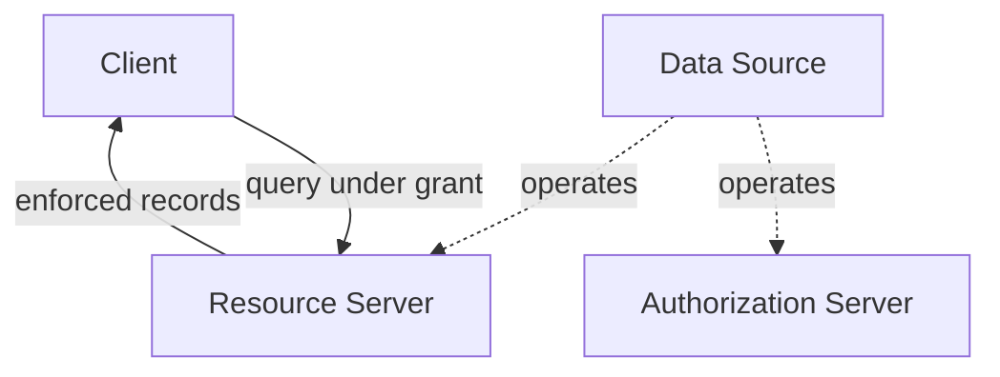
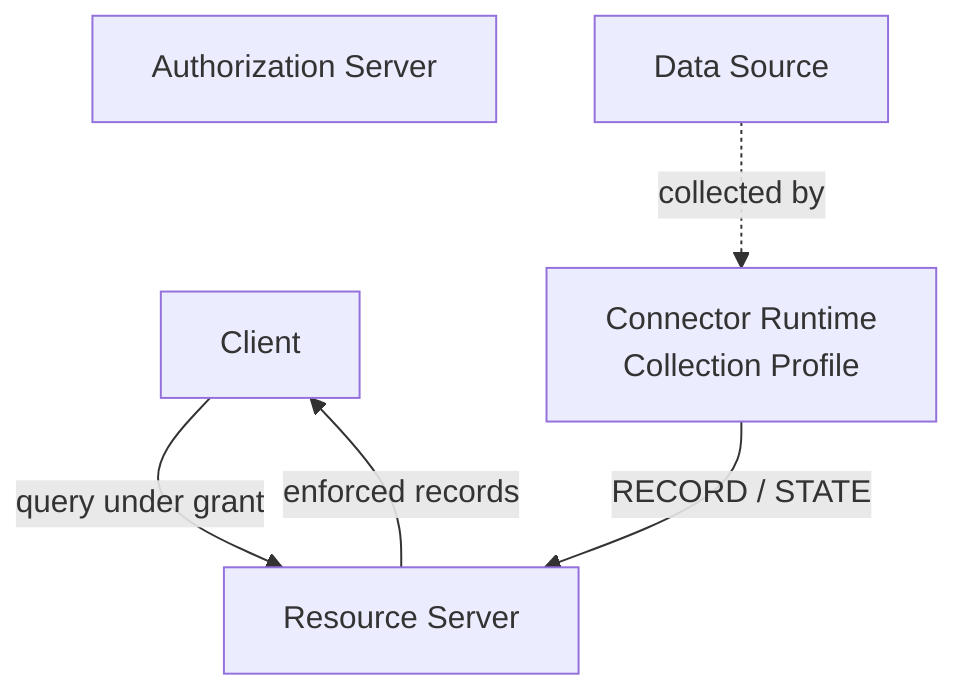

# Personal Data Portability Protocol (PDPP) v0.1.0

Status: Normative draft
Date: 2026-04-06

---

## 1. Introduction {#introduction}

PDPP is an authorization and disclosure protocol for personal data. It defines how a user authorizes an application to access specific data from a data source that holds their records, and how a resource server enforces that authorization.

The protocol specifies:

- A **record model** for representing personal data as flat relational streams
- A **selection request** format, the structured request for consent a client submits during authorization (RFC 9396 envelope)
- A **grant** object representing user-approved, parameterized consent
- A **source declaration** describing the consent, record, selection, and query
  surface exposed by either a connector-backed or provider-native source
- A **resource server interface** for serving records under grant enforcement

**Design axiom:** Source declarations define what can be requested. Grants define what was approved. These are separate concerns and must not be conflated.

Most source platforms do not yet expose a PDPP interface natively. Collection is the bridge for those sources: it brings their data into a resource server so the protocol's consent and enforcement layers can govern access to it. The companion [PDPP Collection Profile](spec-collection-profile) standardizes that bridge. The core protocol is useful without it: a resource server holding pre-collected data can serve that data under grant enforcement with no collection machinery involved, and data may also reach it via regulatory data exports, manual import, or platform-native APIs. The consent and enforcement layers defined in this specification (Sections 5-8) are agnostic to the collection method.

Any implementation satisfying the role conformance criteria in Section 9 is PDPP-compliant. This specification does not depend on any specific network, token, ledger, infrastructure provider, hosted service, centralized registry lookup, or deployment of this repository. URI identifiers name sources, purposes, clients, and resources; they do not make the example registries in this document runtime dependencies. Consent integrity comes from the resolved grant and the exact source declaration snapshot retained by the authorization server.

### Interoperable core sections

Sections 4-8 define the protocol surfaces that implementations evaluate independently.

| Section | Governs | Other layers |
| --- | --- | --- |
| [Section 4: Record Model](#record-model) | Portable record envelopes, stream identity, primary keys, blob references, resource references, stream semantics, and incremental-sync metadata. | Source collection, connector execution, and storage-engine choices. |
| [Section 5: Source Declaration](#source-declaration) | Common source identity, consent, record, selection, and query capabilities used by connector-backed and provider-native sources. | Declaration discovery and trust; connector acquisition and execution mechanics. |
| [Section 6: Selection Request](#selection-request) | What a client asks an authorization server to approve, plus declaration-backed validation and consent rendering before a grant is issued. | Product-specific consent flows, screen layouts, and hosted authorization-server deployments. |
| [Section 7: Grant](#grant) | The immutable consent artifact and the constraints a resource server enforces for a token-bound client. | Grant database schema, signed-token format, hosted registries, and deployment topology. |
| [Section 8: Resource Server Interface](#resource-server-interface) | The interoperable record-query and blob-fetch interface under grant enforcement. | Authorization-server deployment, storage backend, collection runtime, operator dashboard, and hosted service choices. |

### Relationship to existing standards

| Standard | Relationship |
|----------|-------------|
| [OAuth 2.0](https://www.rfc-editor.org/rfc/rfc6749) (RFC 6749) | PDPP is a profile of OAuth 2.0, carrying selection requests in RFC 9396 authorization_details. The grant is issued as the result of an OAuth authorization flow. |
| [RFC 9396](https://www.rfc-editor.org/rfc/rfc9396) (RAR) | PDPP uses the `authorization_details` envelope for selection requests. The `type` URI is `https://pdpp.org/data-access`. |
| [RFC 6750](https://www.rfc-editor.org/rfc/rfc6750) (Bearer Token) | PDPP transports both owner tokens and client tokens as RFC 6750 Bearer Tokens on the wire. The resource server distinguishes token kind via `pdpp_token_kind` in the introspection response, not by token syntax. |
| [RFC 7662](https://www.rfc-editor.org/rfc/rfc7662) (Token Introspection) | PDPP relies on RFC 7662-style token introspection where the authorization server and resource server are separated, so the resource server can resolve grant-bound tokens. Co-located deployments may use a local equivalent. |
| [OAuth 2.0 Dynamic Client Registration](https://www.rfc-editor.org/rfc/rfc7591) (RFC 7591) | PDPP reuses the RFC 7591 client metadata vocabulary (`client_name`, `logo_uri`, `policy_uri`, and similar fields) for the consent display. A dynamic client registration endpoint is a deployment choice and is required only where deployments need it; Core functions without it. |
| [SMART on FHIR](https://hl7.org/fhir/smart-app-launch/) | Follows the domain-profile-over-OAuth pattern PDPP adopts: OAuth handles authorization, and the profile adds a domain data model, consent semantics, and a conformance regime. SMART on FHIR reached ubiquity through regulatory adoption of SMART-on-FHIR-patterned API requirements (the ONC Cures Act rule). |
| [UK Open Banking](https://www.openbanking.org.uk/standards/) | Also follows the domain-profile-over-OAuth pattern PDPP adopts: OAuth handles authorization, and the profile adds a domain data model, consent semantics, and a conformance regime. UK Open Banking reached ubiquity through the CMA's Open Banking mandate for the largest UK banks. |
| [UMA 2.0](https://kantarainitiative.org/uma-2-0-2/) (Kantara) | UMA is important prior art for PDPP's user-managed, standing, revocable access model, particularly where an outside party seeks access to user-controlled resources. PDPP's authorization protocol derives directly from OAuth 2.0 and RFC 9396. |
| [GNAP](https://www.rfc-editor.org/rfc/rfc9635) (RFC 9635) | GNAP is an IETF authorization protocol that revisits OAuth-style delegation with a new protocol design. Several design decisions are directly relevant to PDPP: (1) interaction modes beyond browser redirects (relevant to nonstandard authorization interaction patterns); (2) request continuation for multi-step consent negotiation (relevant to optional streams); (3) key-bound grants instead of bearer tokens (stronger security for ongoing personal data access); (4) built-in grant management with revocation and rotation (relevant to `continuous` access mode). PDPP v0.1 uses OAuth 2.0 + RFC 9396. A future version should evaluate whether GNAP is a better foundation. PDPP's entity-scoped `client_display` already follows GNAP's pattern of carrying client display metadata inline in the request. For key-bound tokens specifically, DPoP (RFC 9449) offers an OAuth-native path to GNAP-style sender-constrained tokens and is a candidate optional hardening profile for v0.2. |
| Solid | Solid takes the full re-architecture approach: personal data moves into user-controlled pods with RDF/Linked Data semantics, which requires source platforms to adopt the model or users to migrate off-platform. PDPP instead layers on existing OAuth infrastructure and bootstraps data supply through the Collection Profile, without requiring source platforms to adopt anything. |
| [Data Transfer Project](https://github.com/dtinit/data-transfer-project) (DTI) | PDPP and DTI are complementary. The Data Transfer Project handles transfer mechanics, and DTI's stated position is that there is "no silver bullet" for portability: multiple approaches coexist. DTI's Data Trust Registry (post-pilot, 2026) addresses who is trusted: it vets services seeking access to platforms' portability interfaces so that platforms can rely on shared trust signals. PDPP addresses what was consented and how it is enforced (the grant and the resource server interface); a trust registry and PDPP's consent semantics compose rather than compete. The two protocols can chain. See Appendix B. |
| Airbyte / Singer | PDPP borrows the RECORD/STATE checkpoint pattern for incremental sync. This record and state-checkpoint lineage informs the Collection Profile companion specification; it appears here for reader orientation and is informative for Core. |
| [GDPR](https://eur-lex.europa.eu/eli/reg/2016/679/oj) | PDPP implements data minimization through stream and field selection. It also carries machine-readable purpose declarations (`purpose_code`) that support consent display, local policy, and implementation-defined audit or transparency mechanisms, with an explicit protocol-level consent rule for `ai_training`. The internal version history required for incremental sync may support implementations that choose to expose historical access features to users. Whether such exposure is required is outside the scope of this specification. This alignment is informative only and is not a required v0.1 capability. |
| [DMA](https://eur-lex.europa.eu/eli/reg/2022/1925/oj) | The `continuous` access mode enables ongoing portability aligned with the DMA's requirements. Article 6(9) requires effective portability with continuous and real-time access to the end user's data; PDPP's continuous grants and incremental sync map to that requirement. This alignment is informative only and is not a required v0.1 capability. |

**Note:** The PDPP Collection Profile is one fulfillment mechanism. A conformance test suite for this specification is planned but is not defined in v0.1 (see Section 9).

---

## 2. Terminology and Actors

### Actors

| Actor | Definition |
|-------|-----------|
| **User** | The person whose data is being accessed. Owns the data, approves grants, may revoke. |
| **Client** | An application or AI agent requesting user data. Identified by `client_id`. In OAuth terms, this is the client. |
| **Data Source** | Any external system from which a user's data originates: a consumer platform, a SaaS application, a device, a local archive, a financial institution, or other system. |

### Protocol roles

These roles may be co-located in a single deployment (e.g., a personal server acting as both authorization server and resource server) or separated. The spec defines the interfaces between roles, not the deployment topology.

| Role | Responsibility |
|------|---------------|
| **Authorization Server** | Issues and manages grants. Validates selection requests against retained source declaration snapshots. Tracks grant lifecycle (active, expired, revoked). |
| **Resource Server** | Stores records as flat relational streams. Serves records to clients filtered by grant parameters. |

The [PDPP Collection Profile](spec-collection-profile) defines a third role:

| Role | Responsibility |
|------|---------------|
| **Connector Runtime** | Runs connectors. Writes collected records to the resource server. Manages incremental sync state. |

In many deployments, a single **personal server** fills all three roles. The spec uses "personal server" when referring to a combined deployment, and the specific role name when the distinction matters.

**Note on the Authorization Server interface:** This spec defines the resource server interface normatively because cross-deployment interoperability requires it: a client written against the interface works with any conformant resource server regardless of who operates it or where data lives. The authorization server interface is not normatively specified in v0.1 because user-facing authorization flows are deployment-specific. The reference implementation uses the OAuth authorization code flow with RFC 9396 authorization_details for client grants, and OAuth device authorization for owner tokens.

**Token resolution:** User-facing authorization flows are deployment-specific and are not normatively specified in v0.1. However, when the AS and RS are deployed separately, the AS↔RS token-resolution contract is normative: the RS resolves access tokens using RFC 7662-style token introspection. For co-located deployments, a local equivalent (shared database or function call) is acceptable. Self-contained JWTs may be used as an optimization but MUST NOT be the sole revocation mechanism (see Section 10).

### Data concepts

| Term | Definition |
|------|-----------|
| **Grant** | An immutable consent artifact specifying what data a client may access, under what constraints. |
| **Stream** | A named collection of records with a schema, primary key, and optional cursor field. Stream names are source-local (e.g., `messages`). The fully qualified identifier is an ordered pair `(source.id, stream_name)`, used in cross-source references and storage. Example: `("https://registry.pdpp.org/connectors/spotify", "top_artists")`. |
| **Record** | A single data object within a stream. |
| **Connector** | A program that collects data from a data source, used when data is collected rather than served natively. One of possibly several producers of a source's streams. Defined in the Collection Profile. |
| **Source Declaration** | A source's versioned declaration of its identity, publisher, streams, schemas, consent surface, selection capabilities, and Resource Server query capabilities. It does not define connector acquisition or execution. |
| **Selection Request** | A client's request for specific data, expressed as RFC 9396 `authorization_details`. |
| **View** | An optional named field set a source declaration may define for a stream, composed from fields declared in the stream schema. When a client requests by view name, the resulting grant records the resolved field list, which is authoritative. Declared views are advisory; the authorization server is authoritative for views used in consent UI and issued grants. |

### Requirements Language {#requirements-language}

The key words "MUST", "MUST NOT", "REQUIRED", "SHALL", "SHALL NOT", "SHOULD", "SHOULD NOT", "RECOMMENDED", "NOT RECOMMENDED", "MAY", and "OPTIONAL" in this document are to be interpreted as described in BCP 14 [RFC 2119] [RFC 8174] when, and only when, they appear in all capitals, as shown here.

This document is normative except where content is explicitly marked as an example, a note, or otherwise non-normative.

The companion [PDPP Collection Profile](spec-collection-profile) uses the same requirements language.

---

## 3. System Architecture

Every PDPP deployment shares the same authorization core: a user grants a client consent, and the authorization server issues a grant. The resource server that then serves records under that grant is not shown here; how it is populated and operated is deployment-specific (see below).



What differs between deployments is how the resource server that fulfills the grant is populated and operated. This is not a closed set: a resource server may hold pre-collected data with no collection machinery involved, or receive data via regulatory export, manual import, or platform-native APIs (Section 1). The two examples below illustrate the ends of that spectrum; the [PDPP Collection Profile](spec-collection-profile) is one fulfillment mechanism, not the only one.

**Example A: source-native fulfillment.** The data source operates its own authorization and resource servers directly; there is no separate collection step.



**Example B: personal-server fulfillment.** A connector runtime, governed by the Collection Profile, collects data from the source and syncs it into a resource server the user controls.



### Protocol layering

PDPP separates three concerns that other systems conflate:

1. **Authorization**: the user's consent about what is disclosed, to whom, and under what constraints. This is the grant. It is the portable core of PDPP.

2. **Disclosure**: the records the resource server returns given a valid grant. This is the resource server query API.

3. **Collection**: how data gets into the resource server in the first place. This is the Collection Profile. It is one answer to this question; pre-loaded data, manual imports, and other mechanisms are equally valid.

The grant and query API are the normative core. Collection is a companion mechanism.

**Ingest and sync-state are Collection Profile concerns.** The core protocol defines the query API (disclosure) and grant semantics. The Collection Profile defines record ingest and sync-state management endpoints for implementations that claim Collection Profile support.

---

## 4. Record Model {#record-model}

**Note:** This section defines portable record envelopes, stream identity, primary keys, blob references, resource references, stream semantics, and incremental-sync metadata. Source collection, connector execution, and storage-engine choices are out of scope for this document (see the [PDPP Collection Profile](spec-collection-profile)).

Personal data is represented as flat relational streams. This enables streaming, pagination, incremental sync, and compatibility with DTI canonical data models.

### Streams

A stream is a named collection of records with a consistent schema. Examples: `playlists`, `messages`, `sleep_sessions`.

### Stream semantics

Each stream has one of two semantic types:

| Semantics | Meaning | Examples | Resource server behavior |
|-----------|---------|----------|------------------------|
| `append_only` | Records are immutable events. New records are added; existing records are never modified. | messages, transactions, play_events, workouts | Insert only. Duplicate keys are idempotent. |
| `mutable_state` | Records represent current state of an entity. Records may be updated or deleted. | profile, settings, playlist_items, follow_lists | Upsert by primary key. Resource server maintains version history for incremental sync. |

Approximately 95% of personal data by volume is `append_only`. The remaining 5% is `mutable_state`. Mutable state records (profiles, preferences, relationships) are often the highest-value context for AI agents.

### Incremental sync for mutable streams

For `mutable_state` streams, the resource server maintains internal version history to support incremental sync queries. This is an implementation detail: the protocol surface is a standard cursor-based query that returns records changed since a given cursor position (see Section 8). The version history is not exposed as a separate stream.

A client that has previously synced a `mutable_state` stream queries for changes by passing its last cursor. The resource server returns only records whose state has changed since that cursor, within the client's grant-authorized field projection. If no authorized fields changed on a record, that record does not appear in the response.

This design ensures that a client authorized for fields A and B cannot infer that field C changed, even if C was modified after the client's last sync. The response is a function of the grant, not of the full record state.

**Snapshot model:** `changes_since` returns the full current state of each record whose grant-authorized projection changed since the cursor position, plus tombstones for deletions. It does not return field-level diffs. The client receives a complete record object for any record that changed.

**Cursor expiry:** Resource servers MAY expire historical version data after a retention period. If a client's cursor has expired, the resource server MUST return HTTP 410 Gone with error code `cursor_expired`. The client MUST perform a full re-sync to re-establish its baseline.

**Two distinct cursor spaces:** `cursor`/`next_cursor` are pagination tokens within a single query execution; `changes_since`/`next_changes_since` are incremental sync tokens across sessions. A client MUST NOT use a `next_cursor` value as a `changes_since` parameter; they are different token spaces and will produce a protocol error if confused. The terminal page of a `changes_since` result MUST include a `next_changes_since` field. Paginating an incremental sync: pass `changes_since` on the first request, follow `next_cursor` for subsequent pages within that session, then store `next_changes_since` from the terminal page for the next session.

**Tombstones:** When a record is deleted from a `mutable_state` stream, the resource server MUST include a tombstone entry in incremental sync responses for clients whose cursor predates the deletion. Tombstone format:

```json
{
  "object": "record",
  "id": "canonical-key-string",
  "stream": "playlists",
  "deleted": true,
  "deleted_at": "2026-04-01T10:00:00Z",
  "emitted_at": "2026-04-01T10:00:01Z"
}
```

Tombstones use the same `object: "record"` envelope as regular response records, with `deleted: true`. The `id` field is the canonical key string (see RECORD envelope, Compound key encoding below). Both `deleted_at` and `emitted_at` are required on tombstone objects. No `data` field is present on tombstones.

`deleted_at` represents the time the record was deleted in the source system, if known; otherwise the time the RS processed the deletion directive. If the source system deletion time is unknown, the RS SHOULD use the `emitted_at` value of the delete directive as `deleted_at`.

**Non-normative note (GDPR Article 15):** The version history maintained internally by the resource server to support `mutable_state` incremental sync may support implementations that choose to expose historical access features to users. Whether such exposure is required is outside the scope of this specification. This alignment is non-normative and is not a required v0.1 capability.

### Split rule

When modeling data from a source, apply this rule:

- **Separate stream** if: has its own stable ID, unbounded cardinality, changes independently, or consumers query it independently.
- **Nested within a record** if: small, bounded, and only meaningful as part of the parent.

Example: `conversations` and `messages` are separate streams (messages are unbounded, have their own IDs, change independently). A message's `content_blocks` array can be nested (bounded, only meaningful within the message).

This is a common data modeling judgment call. The rule above is a guide, not a formula; declaration publishers exercise discretion.

### The RECORD envelope

RECORD is the universal data envelope. It is used in the Collection Profile and is the canonical shape for records stored in the resource server.

```json
{
  "stream": "messages",
  "key": "msg_abc123",
  "data": {
    "id": "msg_abc123",
    "conversation_id": "conv_xyz",
    "role": "user",
    "content": "What is the weather like?",
    "source_created_at": "2026-03-28T15:00:00Z"
  },
  "emitted_at": "2026-03-28T15:01:00Z"
}
```

| Field | Type | Required | Description |
|-------|------|----------|-------------|
| `stream` | string | yes | Stream name |
| `key` | string or string[] | yes | Primary key value. Array for compound keys; order matches the SourceDeclaration `primary_key`. |
| `data` | object | yes | Record payload conforming to the stream schema. |
| `emitted_at` | ISO 8601 | yes | When the record was emitted by its producer (processing time, not source time). |
| `op` | enum | no | `upsert` (default) or `delete`. This field is a directive to the resource server and is not stored as part of the record data. |

**Compound key encoding:** When `primary_key` has multiple fields, `key` is an array of values in the order declared by the SourceDeclaration `primary_key`. The canonical string form of a compound key is the minified JSON array of key values (e.g., `["user_123","2026-04-01"]`). Each primary-key component MUST be serialized as a string in the canonical encoding. Non-string primary-key field values (e.g., integers, dates) MUST be converted to their string representation before encoding. URL path parameters and `resources[]` entries use percent-encoded canonical string form. The `resource_ref.record_id` field retains native `string | string[]` type.

**Record identity:** For any record, the values of the `data` fields named by the stream's `primary_key` MUST match the values in the `key` envelope field (in order). A resource server or profile-defined write interface MUST reject a record before storage when those values disagree. The Collection Profile defines the HTTP error for its ingest endpoint.

### Timestamps

Two timestamp concepts appear in records:

- **`emitted_at`**: when the producer emitted the record. Always present on the RECORD envelope. Producer-generated.
- **Source timestamps**: when the event occurred or the resource was created or modified on the source platform. These are fields within `data`, declared in the stream schema. The spec reserves two standard field names: `source_created_at` and `source_updated_at`. Connector authors SHOULD use these names when the platform provides them, rather than inventing platform-specific names.

### Foreign keys

Streams reference each other via foreign key fields in `data`:

```json
{
  "stream": "conversations",
  "key": "conv_xyz",
  "data": {
    "id": "conv_xyz",
    "title": "Weather chat",
    "source_created_at": "2026-03-28T14:00:00Z"
  }
}
{
  "stream": "messages",
  "key": "msg_abc123",
  "data": {
    "id": "msg_abc123",
    "conversation_id": "conv_xyz",
    "content": "...",
    "source_created_at": "2026-03-28T15:00:00Z"
  }
}
```

The SourceDeclaration declares `primary_key` per stream. Foreign key relationships are declared in its `relationships` field (see Section 5).

### Binary data (blob_ref)

Binary data (photos, videos, audio, documents) is not inlined in records. The record contains metadata and a `blob_ref`:

```json
{
  "stream": "media",
  "key": "media_123",
  "data": {
    "id": "media_123",
    "caption": "Sunset",
    "media_type": "image",
    "source_created_at": "2026-03-28T10:00:00Z",
    "blob_ref": {
      "blob_id": "blob_media_123",
      "mime_type": "image/jpeg",
      "size_bytes": 2048000,
      "sha256": "a1b2c3..."
    }
  }
}
```

`mime_type` MUST be a valid IANA media type (see [IANA Media Types](https://www.iana.org/assignments/media-types/)). Record producers emit `blob_ref` without a `fetch_url`. The resource server injects `fetch_url` at read time when serving records via the query API.

### Cross-stream references (resource_ref)

When a record references a record in a different stream on the same resource server, use a `resource_ref`. This is a within-subject, within-server pointer. Cross-user or cross-server references are out of scope.

```json
{
  "stream": "tag_assignments",
  "key": "assign_1",
  "data": {
    "tag_id": "tag_sunset",
    "target": {
      "source_id": "https://registry.pdpp.org/connectors/instagram",
      "stream": "media",
      "record_id": "media_123"
    }
  }
}
```

---

## 5. Source Declaration {#source-declaration}

**Note:** This section defines the common source surface used by Core. Connector acquisition and execution behavior, including runtime bindings, setup, interaction, refresh, and collection state, is defined by the optional [PDPP Collection Profile](spec-collection-profile).

Each source publishes a `SourceDeclaration` describing its identity, publisher, consent surface, record semantics, selection capabilities, and Resource Server query capabilities. Connector-backed and provider-native sources use the same Core shape. The declaration defines what can be consented to. The resolved grant defines what was approved.

### SourceDeclaration structure

```json
{
  "protocol_version": "0.1.0",
  "source": {
    "kind": "connector",
    "id": "https://registry.pdpp.org/connectors/spotify"
  },
  "declaration_version": "2026-08-11",
  "publisher": {
    "id": "https://registry.pdpp.org/"
  },
  "display": {
    "name": "Spotify"
  },
  "selection_presets": [
    {
      "id": "listening_history",
      "label": "Listening history",
      "streams": [
        { "name": "top_artists" },
        { "name": "play_events" }
      ]
    }
  ],
  "streams": [
    {
      "name": "top_artists",
      "description": "Most-listened artists over time",
      "display": {
        "label": "Your top artists",
        "detail": "Artist names, genres, and popularity scores. No listening timestamps or play counts."
      },
      "semantics": "mutable_state",
      "schema": {
        "$schema": "https://json-schema.org/draft/2020-12/schema",
        "type": "object",
        "properties": {
          "id": { "type": "string" },
          "name": { "type": "string" },
          "genres": { "type": "array", "items": { "type": "string" } },
          "popularity": { "type": "integer" },
          "source_updated_at": { "type": "string", "format": "date-time" }
        },
        "required": ["id", "name"]
      },
      "primary_key": ["id"],
      "cursor_field": "source_updated_at",
      "consent_time_field": "source_updated_at",
      "selection": {
        "fields": true,
        "resources": false
      },
      "query": {
        "range_filters": {
          "source_updated_at": ["gte", "gt", "lte", "lt"]
        }
      },
      "views": [
        {
          "id": "basic",
          "label": "Artist names and genres",
          "fields": ["id", "name", "genres"]
        },
        {
          "id": "full",
          "label": "Full artist data",
          "fields": ["id", "name", "genres", "popularity", "source_updated_at"]
        }
      ]
    },
    {
      "name": "play_events",
      "description": "Individual track play events",
      "semantics": "append_only",
      "schema": {
        "$schema": "https://json-schema.org/draft/2020-12/schema",
        "type": "object",
        "properties": {
          "id": { "type": "string" },
          "track_id": { "type": "string" },
          "played_at": { "type": "string", "format": "date-time" },
          "duration_ms": { "type": "integer" }
        },
        "required": ["id", "track_id", "played_at"]
      },
      "primary_key": ["id"],
      "cursor_field": "played_at",
      "consent_time_field": "played_at",
      "selection": {
        "fields": true,
        "resources": false
      }
    }
  ],
  "extensions": {}
}
```

### SourceDeclaration fields

| Field | Description |
|-------|-------------|
| `protocol_version` | Version of the PDPP SourceDeclaration schema. This contract requires exactly `0.1.0`. |
| `source` | Exactly `{ kind, id }`. `kind` is `connector` or `provider_native`; `id` is the absolute URI authorization identity for the source's data surface. |
| `declaration_version` | Opaque, non-empty revision identifier for this source declaration. It is not the connector software version and has no implied ordering. |
| `publisher.id` | Absolute URI identifying the declaration publisher. Discovery and trust policy determine how this attribution is authenticated. |
| `display.name` | Human-readable source name for consent UIs. It is display metadata, not source identity. |
| `selection_presets` | Optional preset selections. The authorization server expands a selected preset into explicit stream terms before issuing a grant. |
| `streams[].name` | Unique non-empty stream name, source-local. `*` is request-only and is not a declaration stream name. |
| `streams[].description` | Optional short human-readable summary of the stream's contents (e.g., "Most-listened artists over time"). Not consent-surface metadata; see `streams[].display` for the fields the AS renders during consent. |
| `streams[].display` | Optional consent-surface metadata. See [Stream display metadata](#stream-display). |
| `streams[].semantics` | `append_only` or `mutable_state`. |
| `streams[].schema` | JSON Schema for the record's `data` field. `primary_key` and `cursor_field` MUST reference fields declared here. |
| `streams[].primary_key` | Fields that uniquely identify a record within the stream. |
| `streams[].cursor_field` | Field used for logical record ordering in cursor-based reads and incremental sync. List reads sort by `(cursor_field, primary_key)`, with null or absent cursor values sorting after present values. Cursor tokens encode logical sort position rather than storage row ids. |
| `streams[].consent_time_field` | The temporal consent boundary: the field against which `time_range` is evaluated. Absent means `time_range` is not applicable to this stream. MUST reference a field declared in the schema. |
| `streams[].selection` | Which selection parameters this stream supports (`fields`, `resources`). Time-range capability is derived from `consent_time_field` presence; absent means not time-range-capable. The AS MUST reject grants that request `time_range` on a stream without a `consent_time_field`, or that request an unsupported selection parameter. |
| `streams[].views` | Named field projections the declaration publisher suggests. Advisory; the AS is authoritative. Each view has `id`, `label`, and `fields` (top-level field names only). |
| `streams[].relationships` | Declared foreign key relationships to other streams. Structural graph metadata only; does not by itself make a relation expandable in the read API. |
| `streams[].query` | Stream-specific query capability declaration. `range_filters` declares range-queryable fields and operators. `expand` declares expandable relations and per-relation limits. `search` and `aggregations` preserve source-neutral capability declarations used by companion query profiles; their operation semantics and conformance are not defined by Core. |
| `extensions` | Optional object keyed by absolute profile URI. Core preserves or ignores an unknown extension value and does not parse it. An operation that explicitly invokes an unsupported profile is rejected. An extension cannot redefine or weaken Core semantics. |

The public SourceDeclaration JSON Schema declares JSON Schema 2020-12. Each
`streams[].schema` uses that dialect when `$schema` is absent. If `$schema` is
present, it MUST equal `https://json-schema.org/draft/2020-12/schema`. This
dialect choice does not by itself guarantee identical validator behavior. The
AS MUST meta-validate each embedded stream schema before accepting the
declaration. Embedded `$ref` and `$dynamicRef` values MUST be local fragment
references. A declaration MUST NOT make consent interpretation depend on a
mutable remote schema.

`source.id` is the authorization identity. In a retained declaration or grant,
`source.kind` records the provenance class that the AS accepted from its
declaration authority. It is not authorization equality, a runtime type, or a
Collection Profile claim, and it never selects serving or acquisition runtime.
A connector declaration with no Collection extension remains valid Core input.
The declaration never contains owner-specific account or instance handles.
Those appear on each stream in the selection request and resolved grant.

### Stream display metadata {#stream-display}

Streams MAY include a `display` object with human-readable metadata for the consent UI. This metadata is authored by the accepted declaration publisher, not the requesting client.

| Field | Type | Description |
|-------|------|-------------|
| `display.label` | string | Short human-readable name shown in the consent card (e.g., "Who you follow"). If absent, the AS SHOULD display `streams[].description` or fall back to the stream name. |
| `display.detail` | string | Consent-oriented description of what data is included and, where relevant, what is excluded (e.g., "Usernames and account IDs of accounts you follow. No DMs, profile details, or follower lists."). If absent, the AS MAY generate a description from the stream schema, or display no detail. |

**Authorship principle:** `display.label` and `display.detail` describe the data itself, not the requester's purpose. They are attributed to the accepted declaration publisher. The requesting client MUST NOT override or supplement these descriptions in the selection request. The authorization server's discovery and trust policy determines whether publisher attribution is authenticated.

```json
{
  "name": "following_accounts",
  "description": "Accounts the user follows",
  "display": {
    "label": "Who you follow",
    "detail": "Usernames and account IDs of accounts you follow. No DMs, profile details, or follower lists."
  },
  "semantics": "mutable_state",
  "schema": { "..." : "..." }
}
```

### consent_time_field

The `consent_time_field` is the field on each record that the resource server evaluates `time_range` against. It represents the stream's temporal consent boundary: when the user consents to "data from the last 6 months," the `consent_time_field` is the field that determines whether a given record falls within that window.

The `consent_time_field` may be the same field as `cursor_field`, but they serve different purposes and MUST be declared separately:

- `cursor_field` governs incremental sync mechanics (which records to fetch since the last run).
- `consent_time_field` governs consent-time filtering (which records fall within the authorized time window).

For many `append_only` streams, both fields will be the same (e.g., `played_at` for play events). For some `mutable_state` streams they may differ: a playlists stream might use `source_updated_at` as the cursor (for efficient incremental sync) but `source_created_at` as the `consent_time_field` (because the user's consent to "playlists from the last 6 months" most naturally means playlists they created in that period, not playlists they edited).

The `consent_time_field` MUST be rendered in human-readable consent UX. A grant with `time_range: { since: "2026-01-01" }` on the `playlists` stream should be presented as "playlists created on or after January 1, 2026," not just "playlists in time_range."

Streams that cannot define a stable `consent_time_field` simply omit it. The absence of `consent_time_field` is the normative signal that the stream does not support time-range filtering.

### Relationships

```json
{
  "name": "conversations",
  "relationships": [
    {
      "name": "messages",
      "stream": "messages",
      "foreign_key": "conversation_id",
      "cardinality": "has_many"
    }
  ]
}
```

| Field | Description |
|-------|-------------|
| `name` | Relation name (used in `expand[]` on the query API). |
| `stream` | The related stream name. |
| `foreign_key` | The field on the related stream that references this stream's primary key. |
| `cardinality` | `has_many` or `has_one`. |

### Views {#views}

Views are named field projections that the authorization server may define for a stream, composed from fields declared in the stream schema. Views are the unit of consent when a client requests access by view name rather than by explicit field list.

Declaration publishers MAY suggest views. These suggestions are advisory. The authorization server is authoritative for views used in consent UI and issued grants. The AS MUST NOT define a view that includes fields absent from the retained SourceDeclaration schema for the relevant stream.

**View evolution:** Grants are bound to the resolved field set at issuance time: `fields` in the `StreamGrant` is authoritative, not the view name. View evolution (adding new fields to a view) never silently widens existing grants. Re-consent is required before a client can access new fields, even if those fields are subsequently added to a named view the client already has a grant for.

**Authority and registry:** Views defined under `pdpp.org` URI namespaces are controlled by PDPP maintainers via a public change process. Implementations MUST treat unrecognized view URIs as opaque identifiers.

**Note:** Canonical view naming conventions (standard view names with consistent semantics across connectors) are intentionally deferred. The protocol reserves this space; naming conventions will be informed by implementation experience.

### Versioning and snapshots

`declaration_version` is an opaque exact revision identifier. Core does not
assign semantic-version ordering or compatibility meaning to it. A connector
software release can leave the declaration unchanged, and a declaration can
change without a connector release.

The authorization server retains the exact declaration snapshot used to
validate the request and render consent. It uses that same snapshot for
narrowing, issuance, and retained consent evidence. The issued grant records
the declaration revision and every resolved authorization fact. A version
label alone is not a snapshot.

Adding a field, view, stream, or capability to a later declaration never
widens an existing grant. Removing or changing a currently served capability
may make a request technically unsupported, but it does not reinterpret what
the user approved. The Resource Server enforces the resolved grant without a
current declaration lookup. Current serving metadata may only route, describe
current capabilities, narrow, or reject.

---

## 6. Selection Request {#selection-request}

**Note:** This section defines what a client asks an authorization server to approve, plus declaration-backed validation and consent rendering before a grant is issued. Product-specific consent flows, screen layouts, and hosted authorization-server deployments are out of scope for this document.

A client requests specific personal data by including `authorization_details` in an OAuth 2.0 authorization request, following RFC 9396.

```json
{
  "response_type": "code",
  "client_id": "music_recommendations",
  "redirect_uri": "https://app.example.com/callback",
  "scope": "openid",
  "client_display": {
    "name": "Concert Finder",
    "uri": "https://concertfinder.example.com",
    "logo_uri": "https://concertfinder.example.com/logo.png",
    "policy_uri": "https://concertfinder.example.com/privacy",
    "tos_uri": "https://concertfinder.example.com/terms"
  },
  "authorization_details": [
    {
      "type": "https://pdpp.org/data-access",
      "source": { "kind": "connector", "id": "https://registry.pdpp.org/connectors/spotify" },
      "purpose_code": "https://pdpp.org/purpose/personalization",
      "purpose_description": "Recommend concerts based on your listening history",
      "access_mode": "single_use",
      "streams": [
        {
          "name": "top_artists",
          "necessity": "required",
          "instance_ids": ["spotify-account-a"],
          "time_range": { "since": "2025-09-28T00:00:00Z" }
        },
        {
          "name": "play_events",
          "necessity": "optional"
        }
      ],
      "client_claims": {
        "commitments": ["Data used only for concert recommendations"]
      }
    }
  ]
}
```

### Client display metadata {#client-display}

The top-level `client_display` object carries inline client display metadata for the requesting application. PDPP reuses the human-readable client metadata model from OAuth 2.0 Dynamic Client Registration (RFC 7591 Section 2.2), but transports it inline in the authorization request rather than requiring a dynamic client registration endpoint.

Inside `client_display`, PDPP drops the `client_` prefix from `client_name` and `client_uri` because the enclosing object is already client-scoped. The metadata model is otherwise aligned with RFC 7591.

| Field | Type | Required | Status | Description |
|-------|------|----------|--------|-------------|
| `client_display.name` | string | yes | Inline client metadata | Inline equivalent of RFC 7591 `client_name`. Human-readable application name. |
| `client_display.uri` | URI | no | Inline client metadata | Inline equivalent of RFC 7591 `client_uri`. The client's homepage. |
| `client_display.logo_uri` | URI | no | Inline client metadata | RFC 7591 `logo_uri`. URL to a square image representing the client. |
| `client_display.policy_uri` | URI | no | Inline client metadata | RFC 7591 `policy_uri`. URL for the client's privacy policy. |
| `client_display.tos_uri` | URI | no | Inline client metadata | RFC 7591 `tos_uri`. URL for the client's terms of service. |

`client_display` is entity-scoped: it describes the client, not a specific authorization request. It appears at the top level of the authorization request, outside `authorization_details`.

`client_display` is an inline carrier, not necessarily the AS's final rendered identity record. The AS MAY replace or augment inline values with locally registered metadata, validated software-statement metadata, or trust-registry metadata.

**Metadata resolution and rendering obligations:**

1. The AS MUST resolve requester identity metadata from the best available source. Source precedence is local registration or trust-registry metadata, then validated software-statement metadata if supported, then inline `client_display`, then `client_id` fallback.
2. If the resolved metadata contains a display name, the AS MUST display it to the user during consent. If no display name is available, the AS MUST display `client_id` as the requester identity.
3. If the resolved metadata contains `policy_uri` or `tos_uri`, the AS MAY display them as secondary links or disclosures.
4. If the server has a positive trust signal for the client (e.g., domain verification, trust registry membership), it MUST render that status distinctly (e.g., a "verified" badge). If it has no positive trust signal, it MUST treat the client as unverified and SHOULD display an "unverified app" indicator.
5. The AS MUST treat `logo_uri` as untrusted content until it has been accepted under local policy. It MUST NOT fetch and render a client-supplied remote logo in the consent UI unless the client is verified or the asset has been proxied, cached, and approved under local policy. For unverified clients, the AS SHOULD generate a monogram from the resolved display name.
6. If neither resolved metadata nor inline `client_display` provides a display name, the consent UI SHOULD clearly indicate that the client has not provided display metadata.

### Pre-registered public client discovery {#pre-registered-public-clients}

An authorization server MAY support clients that are public and pre-registered by the deployment rather than dynamically registered. Dynamic public-client self-registration is the preferred discoverable path when `registration_endpoint` is advertised. When AS metadata advertises `pre_registered_public` in `pdpp_registration_modes_supported`, the reference publishes `pdpp_pre_registered_public_clients` so agents and third-party clients can discover usable fallback or example `client_id` values without an out-of-band walkthrough.

Each `pdpp_pre_registered_public_clients` entry contains `client_id`, `client_name`, and `token_endpoint_auth_method`. These entries are public client metadata, not authority to access data. The user grant remains the authorization boundary, and the field MUST NOT contain secrets, access tokens, owner-scoped clients, dynamically registered clients, or private registration state.

### Client claims {#client-claims}

The optional `client_claims` object within each `authorization_details` entry carries client-authored, non-enforceable statements about the specific authorization being requested. These are request-scoped, not entity-scoped: a client may make different commitments for different authorization requests.

| Field | Type | Required | Status | Description |
|-------|------|----------|--------|-------------|
| `client_claims.commitments` | string[] | no | Attributed client claim | Free-text policy commitments relevant to this request (e.g., "Data used only for this study"). |

**Trust boundary:** Client claims are self-asserted and unverifiable by the server. The AS MUST render `client_claims` content separately from protocol-enforced grant terms and MUST attribute it to the client (e.g., "[client name] says:"). The AS MUST NOT render client claims in the same visual register as protocol-enforced grant terms, structured policy declarations, or declaration-authored data descriptions.

If rendered on the final owner review surface, `client_claims` MUST be
normalized and bound exactly, with client attribution, into the immutable final
approval artifact and review revision. Retained consent evidence MUST preserve
that binding. They are material consent context, not grant rights. They remain
outside authorization equality, the resolved grant, introspection rights, and
RS enforcement.

**Relationship to `purpose_description`:** `purpose_description` is a first-class request field describing what the authorization is for. It is part of the authorization semantics the user reviews. `client_claims.commitments` are supplementary promises that are not reducible to structured protocol fields. Both are client-authored, but `purpose_description` is the primary purpose statement while `commitments` are additional assurances.

**Commitments that ARE machine-readable:** Structured grant fields (e.g., `retention.max_duration`, `access_mode`) SHOULD be rendered by the AS as server-generated display text (e.g., "Deleted within 90 days", "Ongoing access until you revoke it"). Clients SHOULD NOT duplicate machine-readable constraints as free-text commitments. If a commitment duplicates a structured field, the structured field is authoritative.

### Semantic classes and consent-surface rendering

PDPP uses three primary semantic classes across selection requests and grants:

- **Protocol-enforced constraints:** Values the AS and/or RS actually validate or enforce, such as stream selection, field projection, `time_range`, `resources`, and `access_mode`.
- **Structured policy declarations:** Machine-readable statements that matter for consent, local policy, and implementation-defined audit or transparency mechanisms, but are not generally self-enforcing at the protocol layer. In v0.1 this includes `purpose_code`, `purpose_description`, and `retention`, with one explicit exception: `https://pdpp.org/purpose/ai_training` adds a protocol-level consent requirement.
- **Attributed client claims:** Client-authored statements that may matter to the user but are not protocol facts. In v0.1 this is `client_claims`.

`client_display` is a separate category: requester identity metadata used to identify who is asking, not a grant constraint. Inline values may be client-asserted, but the AS renders them under its own resolution and trust policy.

PDPP does not standardize consent screen layout, visual design, or copywriting. It does normatively constrain semantic rendering. A conformant AS MUST preserve the distinction between protocol-enforced terms, structured policy declarations, declaration-authored data descriptions, and client-authored claims. It MUST NOT flatten these categories into a single undifferentiated consent surface.

### Request-level parameters

| Parameter | Type | Required | Status | Description |
|-----------|------|----------|--------|-------------|
| `source` | object | yes | Protocol-enforced | Source binding. `id` is required and is the stable absolute URI authorization identity for the data surface. `kind` is optional. When present, it is a client trust expectation that the accepted declaration's provenance class is `connector` or `provider_native`. It is not authorization equality and never selects runtime. |
| `purpose_code` | URI | yes | Structured policy declaration | Machine-readable purpose (absolute URI). See Appendix A for the initial registry. The AS MUST accept any syntactically valid absolute-URI purpose code. For unrecognized codes, the AS MUST display `purpose_description` if present, or the raw URI if not, and MUST NOT reject the request solely because the purpose code is unrecognized. Consent properties associated with purpose codes in the registry are advisory, not protocol-enforced, with the exception of `https://pdpp.org/purpose/ai_training` (see below). |
| `purpose_description` | string | no | Structured policy declaration | Human-readable purpose, displayed to the user during consent. Clients SHOULD provide this field. When present, the AS MUST display it. For standard purpose codes, the AS MAY display a human-readable label from the registry when `purpose_description` is absent. |
| `access_mode` | enum | yes | Protocol-enforced | `single_use` or `continuous`. See Section 7. |
| `retention` | object | no | Structured policy declaration | Requested retention constraints: `{ max_duration, on_expiry }`. |
| `streams` | StreamRequest[] | yes (unless `selection_preset` is used) | Protocol-enforced | Requested streams with per-stream parameters. |
| `selection_preset` | string | no | Protocol-enforced at issuance time | Reference to a SourceDeclaration preset, as an alternative to explicit streams. |
| `client_claims` | object | no | Attributed client claim | Client-authored, non-enforceable claims about this request. See [Client claims](#client-claims). |

#### Source kinds {#source-kinds}

| `source.kind` | Meaning |
|---|---|
| `"connector"` | The declaration authority represents a connector-backed source. `source.id` is its public source URI, not a local package name, connector key, storage namespace, account identifier, or runtime binding. A connector declaration remains Core-valid without Collection Profile data. |
| `"provider_native"` | The declaration authority represents the provider's own PDPP data surface. `source.id` is normally the OAuth protected-resource identifier for that surface, not merely the provider's legal-entity URI. |

If the request includes `source.kind`, an unrecognized value or a mismatch
with the AS-accepted declaration provenance produces a Source validation
failure before consent. If the request omits `source.kind`, the AS derives
provenance from the accepted declaration and records it in consent evidence
and any issued grant. The OAuth/RAR binding returns RFC 9396
`invalid_authorization_details` for invalid authorization details.

#### AI training consent {#ai-training-consent}

The AS MUST obtain explicit affirmative user consent before issuing any grant with `purpose_code` value `https://pdpp.org/purpose/ai_training`. This is the sole purpose code with a mandatory consent requirement at the protocol level.

### Stream selection parameters

Per-stream, within the `streams` array. All are optional except `name`.

| Parameter | Type | Status | Description |
|-----------|------|--------|-------------|
| `name` | string | Protocol-enforced | Stream name, or `*` for all streams (resolved at consent time against the retained SourceDeclaration). |
| `necessity` | enum | Consent-flow control at issuance time | `required` (default) or `optional`. Optional streams are presented as user choices during consent. |
| `instance_ids` | string[] | Protocol-enforced | Optional opaque owner-instance handles for this stream. Handles are scoped to issuer, subject, `source.id`, and stream. Omission never means fan-in. The AS resolves exactly one eligible handle or requires an explicit owner choice. |
| `time_range.since` | ISO 8601 | Protocol-enforced | Earliest data to include (inclusive, >=), evaluated against the stream's `consent_time_field`. |
| `time_range.until` | ISO 8601 | Protocol-enforced | Latest data to include (exclusive, <), evaluated against the stream's `consent_time_field`. A hard cap: applies to future resources as well as past ones. |
| `view` | string | Protocol-enforced at issuance time | Named view defined by the authorization server. Mutually exclusive with `fields` in a request; both MUST NOT be present simultaneously. AS returns 400 `invalid_request` if both are present. |
| `fields` | string[] | Protocol-enforced | Field allowlist. Schema-required fields are always included regardless of this list. In v0.1, restricted to top-level field names only. Mutually exclusive with `view`. |
| `resources` | string[] | Protocol-enforced | Specific record IDs to authorize. Values are canonical key strings: minified JSON array for compound keys, plain string for simple keys. The AS validates arity and type against the retained declaration's `primary_key` at grant issuance. The RS filters by exact primary-key match. |

**Note on `time_range`:** `time_range` is only valid for streams that declare a `consent_time_field`. The authorization server MUST reject selection requests that specify `time_range` on a stream without that field. Its presence in the retained declaration is the authoritative signal that a stream is time-range-capable.

**Note on wildcards:** `"streams": [{ "name": "*" }]` requests all streams declared by the source. This is resolved against the retained snapshot and frozen as an explicit list in the grant. If the wildcard request includes `instance_ids`, the AS applies the requested handles to every expanded stream and verifies that each handle is eligible for that stream. If it omits `instance_ids`, the usual exactly-one eligible instance rule applies to every expanded stream.

A wildcard entry MUST be the only entry in `streams`. Otherwise stream names
MUST be unique within the request.

**Note on `streams` vs `selection_preset`:** Exactly one is required. Source validation fails if both or neither are present. The OAuth/RAR binding maps this failure to RFC 9396 `invalid_authorization_details`.

**Note on defaults:** In a request, omitting `fields` and `view` asks the AS to resolve all permitted fields from the retained snapshot. Omitting `time_range` asks for no temporal constraint. Omitting `instance_ids` never asks for fan-in. The issued grant contains explicit non-empty `fields` and `instance_ids`. Clients SHOULD request only the data they need (see Section 11, Data Minimization).

### Selection presets

Source declarations may define selection presets. A client can reference a preset instead of constructing explicit stream selections:

```json
{
  "type": "https://pdpp.org/data-access",
  "source": { "kind": "connector", "id": "https://registry.pdpp.org/connectors/instagram" },
  "purpose_code": "https://pdpp.org/purpose/personalization",
  "access_mode": "single_use",
  "selection_preset": "social_summary"
}
```

The authorization server expands the preset from the retained snapshot into
explicit streams and fields before final owner review and issuance.
Each selection preset MUST NOT contain the same stream name more than once.
Duplicate stream names make the declaration invalid. They are not deferred to
grant issuance.

Every field in the issued grant is derived from either the selection request, client registration, or authorization server policy. The grant never contains values whose source is ambiguous.

---

## 7. Grant {#grant}

**Note:** This section defines the immutable consent artifact and the constraints a resource server enforces for a token-bound client. Grant database schema, signed-token format, hosted registries, and deployment topology are out of scope for this document.

The grant is an immutable consent artifact. It is the output of the authorization flow.

The authorization server issues an access token bound to the grant. The client uses the access token (not the raw grant) to authenticate with the resource server. The resource server resolves the token to the grant and enforces its constraints on every request. Grant lifecycle (active, expired, revoked) is tracked by the authorization server, not stored in the grant itself.

```json
{
  "version": "0.1.0",
  "grant_id": "grt_8f72a1b3",
  "issued_at": "2026-04-06T15:00:00Z",
  "subject": { "id": "user_abc123" },
  "client": { "client_id": "music_recommendations" },
  "source": { "kind": "connector", "id": "https://registry.pdpp.org/connectors/spotify" },
  "source_declaration": { "version": "2026-08-11" },
  "purpose_code": "https://pdpp.org/purpose/personalization",
  "purpose_description": "Recommend concerts based on your listening history",
  "access_mode": "single_use",
  "streams": [
    {
      "name": "top_artists",
      "instance_ids": ["spotify-account-a"],
      "fields": ["id", "name", "genres", "popularity", "source_updated_at"],
      "time_constraint": {
        "field": "source_updated_at",
        "since": "2025-09-28T00:00:00Z"
      }
    }
  ],
  "retention": {
    "max_duration": "P1Y",
    "on_expiry": "delete"
  },
  "expires_at": "2027-04-06T00:00:00Z"
}
```

### Grant fields

**The following field table is normative.** TypeScript types in Section 13 are non-normative.

| Field | Type | Required | Status | Description |
|-------|------|----------|--------|-------------|
| `version` | string | yes | Protocol metadata | Grant schema version. This contract requires exactly `0.1.0`. |
| `grant_id` | string | yes | Protocol metadata | Unique identifier. |
| `issued_at` | ISO 8601 | yes | Protocol metadata | When the grant was issued. |
| `subject` | object | yes | Identity binding | Exactly `{ id }`. The `subject.id` is an opaque string, unique within the issuing AS's namespace. No format constraint is imposed. |
| `client` | object | yes | Identity binding | Exactly `{ client_id }` or `{ client_id, client_display }`. `client_display`, when retained, is the requester identity metadata resolved by the AS, not unverified inline input. |
| `source` | object | yes | Protocol-enforced | Exact `{ kind, id }` retained from the accepted SourceDeclaration. `id` is authorization identity; `kind` is provenance metadata. |
| `source_declaration` | object | yes | Protocol evidence | `{ version }` records the opaque revision of the exact declaration snapshot used for consent and issuance. It is evidence metadata, not a live lookup authority. |
| `purpose_code` | URI | yes | Structured policy declaration | Machine-readable purpose (see Appendix A). |
| `purpose_description` | string | no | Structured policy declaration | Human-readable purpose. |
| `access_mode` | enum | yes | Protocol-enforced | `single_use` or `continuous`. |
| `streams` | StreamGrant[] | yes | Protocol-enforced | Granted streams. Always expanded; no wildcards. See StreamGrant fields table below. |
| `selection_preset` | string | no | Informational | Which SourceDeclaration preset was selected. The resolved streams and fields remain authoritative. |
| `retention` | object | no | Structured policy declaration | Policy commitment by the data recipient (see below). |
| `expires_at` | ISO 8601 or null | no | Protocol-enforced | Grant expiry. null means no expiry. |

### StreamGrant fields

| Field | Type | Required | Status | Description |
|-------|------|----------|--------|-------------|
| `name` | string | yes | Protocol-enforced | Unique stream name within the grant. Always concrete; no wildcards in issued grants. |
| `instance_ids` | string[] | yes | Protocol-enforced | Unique non-empty opaque instance handles scoped to issuer, subject, source ID, and this stream. Multiple handles authorize fan-in only when explicitly listed. |
| `fields` | string[] | yes | Protocol-enforced | Unique non-empty resolved field allowlist, authoritative for RS enforcement. Top-level field names only. |
| `time_constraint` | object | no | Protocol-enforced | Frozen `{ field, since?, until? }` resolved from the retained declaration. `field` is required and at least one bound is present. `since` is inclusive; `until` is exclusive. |
| `resources` | string[] | no | Protocol-enforced | Authorized record IDs in canonical key string encoding. Absent means all records. |

Request-only conveniences such as wildcard names, `view`, omitted fields, and omitted instance handles are fully resolved before final owner review and issuance. They are not continuing authority in the grant. Selection provenance may be retained at grant level through `selection_preset`; the concrete stream rows remain authoritative.

Before the final approval surface is shown, the AS MUST resolve omitted
`instance_ids` to exact eligible instance handles or require an explicit owner
choice. The final approval artifact MUST include the exact resolved
`instance_ids`, stream names, fields, resources, temporal field, `since`,
`until`, purpose, retention, client identity, and grant expiry. If
`client_claims` are rendered during final review, the final approval artifact
and review revision MUST also bind the normalized exact claims with client
attribution. Retained consent evidence MUST preserve that binding. The approval
mutation MUST bind to an immutable review revision or digest over the
authorization decision fields. `client_claims` MUST remain outside the
resolved grant and RS enforcement. If instance eligibility or the reviewed
revision becomes stale before approval, the AS MUST reject approval and require
a new review.

### Time concepts

The grant carries three orthogonal time-related concepts that must not be conflated:

| Concept | Fields | Meaning |
|---------|--------|---------|
| Grant validity period | `issued_at`, `expires_at` | How long the authorization itself is active. |
| Data temporal scope | `streams[].time_constraint` | Which records the client is authorized to see and which record field defines that boundary. |
| Access pattern | `access_mode` | Whether the grant can be exercised once or continuously. |

A grant can be short-lived (expires in 1 hour) but cover all historical data (no `time_constraint`). A grant can be long-lived but cover only data from the last 6 months (`time_constraint.since`). A grant can be `single_use` but cover a large historical window. These combinations are all valid and distinct.

### Version layering

Three independent version axes exist in PDPP. They MUST NOT be conflated:

| Axis | Field | Meaning |
|------|-------|---------|
| Grant schema version | `grant.version` | Version of the PDPP grant schema. RS MUST reject grants with unsupported major versions, returning 400 `unsupported_version`. |
| Source declaration revision | `grant.source_declaration.version` | Identifies the exact retained declaration snapshot used for consent and issuance. It is opaque evidence metadata. The RS enforces the resolved grant and does not fetch that revision for authorization. |
| HTTP API contract version | `PDPP-Version` request header | Version of the RS HTTP API contract. RS returns 400 `unsupported_version` if the requested version is not supported. If the header is absent, the RS uses the current stable version and returns the selected version in the response header (see Section 8). |

### Access modes {#access-modes}

| Mode | Behavior |
|------|----------|
| `single_use` | The grant is consumed at first token issuance. The AS marks the grant consumed atomically with issuance of the first client access token. The AS MUST reject subsequent attempts to issue new client access tokens against the same consumed grant. The RS honors all tokens issued against the grant until token expiry or revocation. The client MAY retry or resume pagination using the same access token. Failure to complete retrieval before token expiry does not un-consume the grant. |
| `continuous` | The grant is fulfilled repeatedly. The client may query the resource server incrementally over time. Active until expiry or revocation. |

### time constraint semantics

The request's `time_range` is resolved against the retained stream
`consent_time_field` into the grant's `time_constraint`. The grant freezes that
field with the bounds. The filter is:

```
record[time_constraint.field] >= time_constraint.since  (if since is present)
record[time_constraint.field] <  time_constraint.until  (if until is present)
```

`time_constraint.until` is a hard cap. It applies equally to records that existed at grant issuance and to records created afterward. A `continuous` grant with `time_constraint.until` set to a past date is valid: it is a historical-only grant that will never disclose new records. This is not an error.

For `continuous` grants without `time_constraint.until`, future records in a granted stream are included as they are collected, provided the frozen field falls within any `since` constraint. Stream names and fields are frozen at consent time; future stream types or fields require a new grant.

### Standing authorization

Grants freeze stream names, instance handles, fields, and any time constraint at consent time. Within that resolved scope, future records are included for `continuous` grants. Future stream types or fields are not included; they require a new grant.

### Grant narrowing

Grant narrowing (reducing the scope of an existing grant) is not supported in v0.1. Scope reduction is achieved via revoke-and-reissue: the client revokes the existing grant and the user issues a new, narrower grant. Authorization server UIs SHOULD model this flow as revocation followed by a new grant request.

### Records from revoked grants

Revocation stops future access only. Records already delivered to the client before revocation are governed by the grant's `retention` policy and applicable legal obligations. PDPP does not retroactively reach into client-side data stores.

### Retention

Retention is a structured policy declaration and policy commitment by the data recipient (the client). PDPP does not technically enforce retention. Enforcement is through legal agreements, contractual obligations, or trust registry mechanisms. This is consistent with how OAuth 2.0 treats scope compliance: the protocol makes the commitment legible and machine-readable; external mechanisms enforce it.

```json
{
  "max_duration": "P6M",
  "on_expiry": "delete"
}
```

| Field | Type | Description |
|-------|------|-------------|
| `max_duration` | ISO 8601 duration | How long the client may retain collected data. |
| `on_expiry` | enum | `delete` or `anonymize`. Note: `archive` is not supported in v0.1. |

### Examples

**Specific data, single use:**
```json
{
  "version": "0.1.0",
  "grant_id": "grt_001",
  "issued_at": "2026-04-06T15:00:00Z",
  "subject": { "id": "user_abc" },
  "client": { "client_id": "concert_app" },
  "source": { "kind": "connector", "id": "https://registry.pdpp.org/connectors/spotify" },
  "source_declaration": { "version": "2026-08-11" },
  "purpose_code": "https://pdpp.org/purpose/personalization",
  "access_mode": "single_use",
  "streams": [
    {
      "name": "top_artists",
      "instance_ids": ["spotify-account-a"],
      "fields": ["id", "name", "genres", "popularity", "source_updated_at"],
      "time_constraint": {
        "field": "source_updated_at",
        "since": "2025-09-28T00:00:00Z"
      }
    }
  ]
}
```

**Continuous access for an AI agent:**
```json
{
  "version": "0.1.0",
  "grant_id": "grt_002",
  "issued_at": "2026-04-06T15:00:00Z",
  "subject": { "id": "user_abc" },
  "client": { "client_id": "personal_agent" },
  "source": { "kind": "connector", "id": "https://registry.pdpp.org/connectors/openai" },
  "source_declaration": { "version": "2026-08-11" },
  "purpose_code": "https://pdpp.org/purpose/agent_context",
  "access_mode": "continuous",
  "streams": [
    {
      "name": "conversations",
      "instance_ids": ["openai-account-a"],
      "fields": ["id", "title", "source_created_at", "source_updated_at"]
    },
    {
      "name": "messages",
      "instance_ids": ["openai-account-a"],
      "fields": ["id", "conversation_id", "role", "content", "source_created_at"]
    }
  ],
  "expires_at": null
}
```

**Health data with field selection and retention:**
```json
{
  "version": "0.1.0",
  "grant_id": "grt_003",
  "issued_at": "2026-04-06T15:00:00Z",
  "subject": { "id": "user_abc" },
  "client": { "client_id": "sleep_analysis" },
  "source": { "kind": "connector", "id": "https://registry.pdpp.org/connectors/oura" },
  "source_declaration": { "version": "2026-08-11" },
  "purpose_code": "https://pdpp.org/purpose/analytics",
  "access_mode": "single_use",
  "streams": [
    {
      "name": "sleep_sessions",
      "instance_ids": ["oura-account-a"],
      "fields": ["day", "total_sleep_duration", "sleep_score"],
      "time_constraint": {
        "field": "day",
        "since": "2026-01-01T00:00:00Z",
        "until": "2026-04-01T00:00:00Z"
      }
    }
  ],
  "retention": { "max_duration": "P90D", "on_expiry": "delete" }
}
```

---

## 8. Resource Server Interface {#resource-server-interface}

**Note:** This section defines the interoperable record-query and blob-fetch interface under grant enforcement. Authorization-server deployment, storage backend, collection runtime, operator dashboard, and hosted service choices are out of scope for this document.

The resource server stores records and serves them to clients filtered by grants. This section is normative: a compliant resource server must implement this interface for cross-deployment interoperability.

### Grant enforcement

On every request, the resource server:

1. Resolves the access token via token introspection (RFC 7662-style) or a local equivalent for co-located deployments. Positive introspection results MUST NOT be cached longer than `min(token_exp, 60 seconds)`.
2. Verifies that the grant is active (`active: true` in the introspection response).
3. Verifies that the requested stream appears in the grant's `streams` list.
4. Selects records only from the explicitly granted `instance_ids` and verifies that the request falls within the grant's `time_constraint`, `fields`, and `resources` constraints.
5. If all checks pass, returns records filtered accordingly.
6. If any check fails, returns a structured error (see Errors below).

The RS computes `effective_filter = grant_filter AND request_filter`. Request filters can only narrow what the grant allows; they cannot widen it.

The RS MUST NOT re-validate authorization against the current SourceDeclaration. All enforcement constraints are in the resolved grant. Current serving metadata MAY route a granted instance, describe current schemas or query capabilities, or reject a request that cannot currently be served. It MUST NOT widen or reinterpret a stream, instance, field, time field, bound, or resource key.

**Token type distinction:** The format of the access token is opaque to the Resource Server. The RS MUST determine the token's properties (including `pdpp_token_kind`) solely from the introspection response, never from token syntax.

### Token introspection

For separated AS/RS deployments, the RS calls the AS introspection endpoint (RFC 7662). PDPP defines the following extension fields in the introspection response:

| Field | Type | Description |
|-------|------|-------------|
| `active` | boolean | Whether the token is currently valid. |
| `pdpp_token_kind` | string | `"owner"` or `"client"`. |
| `subject_id` | string | The subject (user) identifier. |
| `grant_id` | string | The associated grant identifier. Present for client tokens. |
| `client_id` | string | The client identifier. Present for client tokens. |
| `exp` | integer | Expiry timestamp (Unix epoch). |

**Token kind extensibility:** This specification defines `owner` and `client`. Deployments MAY introduce additional token kinds in companion profiles. A resource server that receives a `pdpp_token_kind` value it does not recognize MUST treat the token as unauthorized for all operations defined in this specification.

Positive introspection results MUST NOT be cached longer than `min(token_exp, 60 seconds)`. Self-contained JWTs (e.g., signed JWTs) are allowed as an optimization but MUST NOT be the sole revocation mechanism; the RS MUST still be able to check active status through introspection or local equivalent.

### Authentication

Two authentication boundaries exist:

**Owner operations:** `Authorization: Bearer <owner_token>`. Core owner tokens are scoped to a single subject's data store and support the Core owner and self-export operations defined here. The RS MUST derive the `subject_id` from the introspection response and MUST reject any request attempting to access data outside that subject's scope. Companion profiles may define additional owner-authenticated operations. How the owner obtains this token is out of scope (device code flow, API key, or any other mechanism).

**Client operations** (query records, list streams, fetch blobs): `Authorization: Bearer <access_token>`. Access tokens are bound to a specific grant. Both token types use RFC 6750 Bearer Token format. The RS distinguishes them via `pdpp_token_kind` in the introspection response.

**Self-export:** An owner holding a valid owner token MAY query their own data using the standard client query endpoints without a client grant. This is the v0.1 self-export mechanism and does not require a separate grant. Conformant Core RS implementations SHOULD support this capability (see Section 9 conformance item 13).

### Endpoints

#### List streams

```
GET /v1/streams
Authorization: Bearer <access_token>
```

Returns the streams available under the current grant with record counts.

**Response:**
```json
{
  "object": "list",
  "data": [
    {
      "object": "stream",
      "name": "conversations",
      "record_count": 2196,
      "last_updated": "2026-04-06T15:01:00Z",
      "freshness": {
        "captured_at": "2026-04-06T15:01:00Z",
        "status": "current",
        "last_attempted_at": "2026-04-06T15:01:00Z"
      }
    },
    {
      "object": "stream",
      "name": "messages",
      "record_count": 48302,
      "last_updated": "2026-04-06T15:01:00Z",
      "freshness": {
        "captured_at": "2026-04-06T15:01:00Z",
        "status": "current",
        "last_attempted_at": "2026-04-06T15:01:00Z"
      }
    }
  ]
}
```

#### Get stream metadata {#stream-metadata}

```
GET /v1/streams/{stream}
Authorization: Bearer <access_token>
```

Returns full source stream metadata. This endpoint is not grant-projected: grants determine whether the caller may access the stream and what reads or queries are permitted, but they do not redact or rewrite the metadata document returned here. Response:

```json
{
  "object": "stream_metadata",
  "name": "top_artists",
  "schema": { },
  "primary_key": ["id"],
  "cursor_field": "source_updated_at",
  "consent_time_field": "source_updated_at",
  "selection": {
    "fields": true,
    "resources": false
  },
  "query": {
    "range_filters": {
      "source_updated_at": ["gte", "gt", "lte", "lt"]
    },
    "expand": [
      { "name": "messages", "default_limit": 10, "max_limit": 50 }
    ]
  },
  "freshness": {
    "captured_at": "2026-04-06T15:01:00Z",
    "status": "current",
    "last_attempted_at": "2026-04-06T15:01:00Z"
  },
  "views": [
    { "id": "basic", "label": "Artist names and genres", "fields": ["id", "name", "genres"] }
  ],
  "relationships": [
    { "name": "messages", "stream": "messages", "foreign_key": "conversation_id", "cardinality": "has_many" }
  ]
}
```

#### Freshness metadata

A resource server MAY attach a `freshness` object to stream listings, stream metadata, and record-list responses.

Freshness is server-observed disclosure metadata, not a grant constraint. It reports what the server knows about the recency of the underlying data relevant to the response. It does not guarantee that the source has not changed since `captured_at`, and it does not widen or narrow access rights.

| Field | Type | Description |
|-------|------|-------------|
| `captured_at` | ISO 8601 or null | Time of the most recent successful collection or source confirmation that could have affected the response. null if unknown. |
| `status` | enum | `current`, `stale`, or `unknown`. `stale` means the server believes the stored data may no longer reflect source state based on local collection policy or failed refresh attempts. |
| `last_attempted_at` | ISO 8601 or null | Time of the most recent attempted refresh relevant to the response, if tracked. |

#### List records {#list-records}

```
GET /v1/streams/{stream}/records
Authorization: Bearer <access_token>
```

Returns records from a stream, filtered by the grant and any additional request parameters.

**Query parameters:**

| Parameter | Type | Description |
|-----------|------|-------------|
| `limit` | integer | Records per page. Default 25, max 100. A request for more than 100 is clamped to 100 and the response carries a non-fatal `limit_clamped` warning (see below), not an error. |
| `cursor` | string | Opaque pagination token from a previous response. Clients MUST NOT parse or construct cursor tokens. |
| `order` | enum | `desc` (default) or `asc`. |
| `filter[{field}]` | string | Exact match filter on an authorized top-level scalar field. |
| `filter[{field}][gte]` | string | Greater than or equal. Valid only for fields declared in `query.range_filters`. |
| `filter[{field}][gt]` | string | Greater than. Valid only for fields declared in `query.range_filters`. |
| `filter[{field}][lte]` | string | Less than or equal. Valid only for fields declared in `query.range_filters`. |
| `filter[{field}][lt]` | string | Less than. Valid only for fields declared in `query.range_filters`. |
| `view` | string | Owner-token current-capability request for records projected to a named view. Client-token records requests MUST reject `view`; clients use explicit `fields` or the field projection already frozen into the grant. Mutually exclusive with `fields`. |
| `fields` | comma-separated | Sparse fieldset. Schema-required fields are always included. In v0.1, restricted to top-level field names only. Mutually exclusive with `view`. |
| `expand[]` | string | Expand a relation declared under `query.expand`. Depth is 1. Expanded relations appear under the `expanded` key on the parent record. |
| `expand_limit[{relation}]` | integer | Max records per expanded `has_many` relation. Valid only for relations declared under `query.expand`; defaults and limits come from that declaration. |
| `changes_since` | string | Opaque incremental-sync token from a previous session (distinct token space from `cursor`). Returns only records whose grant-authorized projection changed since that cursor, plus tombstones for deletions. Use `next_changes_since` from the terminal page to seed the next session. Returns HTTP 410 Gone with error code `cursor_expired` if the cursor has expired. |

The durable client-token base query surface in v0.1 is: `limit`, `cursor`, `order`, exact top-level scalar `filter[{field}]`, `fields`, `changes_since`, and blob fetch. Owner-token current-capability reads MAY also support `view`. Advanced stream-specific query power MUST be declared in stream metadata under `query`.

Unknown query parameters and unsupported query shapes MUST be rejected with HTTP 400 and MUST NOT be silently ignored.

**Non-fatal warnings:** A list response MAY carry a `meta.warnings[]` array reporting non-fatal lossiness that the server resolved without failing the request. Each entry has a stable `code` and a human-readable `message`; clients SHOULD branch on `code`, not on message text. A `limit` above the maximum is the canonical case: the RS returns the bounded page and a `limit_clamped` warning rather than silently dropping the excess or returning an error. Clients page forward with the returned cursor instead of expecting a larger page. Warnings are not errors and MUST NOT change the HTTP status.

Exact `filter[{field}]` applies only to authorized top-level scalar fields. Unknown fields and non-scalar fields are HTTP 400. Fields outside the grant's authorized projection are HTTP 403 `field_not_granted`.

Range filters (`gte`, `gt`, `lte`, `lt`) apply only to fields declared in `query.range_filters`. Nested paths, arrays, OR grammar, and full-text search are not part of v0.1.

Expansion is declaration-driven. A relation is structurally present if listed under `relationships`, but it is only expandable if declared under `query.expand`. `expand_limit[{relation}]` is only valid for declared `has_many` relations.

**Stable sort:** Records are sorted by `(cursor_field, primary_key)` for cursor safety. Null or absent `cursor_field` values sort after present values.

Page cursors are direction-bound: a client MUST follow a `next_cursor` with the same `order` value that produced it. To change direction, the client MUST restart pagination without a cursor. Resource servers MUST reject order-mismatched page cursors as `invalid_cursor`.

**Incremental sync for mutable streams:** Pass `changes_since` to retrieve only records changed since a previous sync. The resource server returns changed records within the grant's authorized field projection. If a record was deleted, a tombstone entry is included. If the cursor has expired (HTTP 410 Gone with error code `cursor_expired`), the client MUST perform a full re-sync.

Eligibility for `changes_since` MUST be computed on the grant-authorized projection, not on the unprojected record. Returning a record whose authorized projection is unchanged is a protocol violation because it leaks that hidden fields changed.

If a `changes_since` response is paginated, all pages in that session MUST be anchored to the same session horizon selected on the first page. New writes arriving after page 1 MUST NOT appear in later pages of that same session; they surface in the next session via the terminal-page `next_changes_since`.

**Filter on unauthorized field:** RS MUST reject a `filter[{field}]` parameter targeting a field outside the grant's authorized projection with 403 `field_not_granted`.

**Expansion:** Requesting an undeclared relation returns 400 `invalid_expand`. Requesting expansion of a stream not in the grant returns 403 `insufficient_scope`. Expansion never widens stream or field permissions beyond the grant.

**Response:**
```json
{
  "object": "list",
  "url": "/v1/streams/conversations/records",
  "has_more": true,
  "next_cursor": "eyJjcmVhdGVkX2F0IjoiMjAyNi0wMy0yNVQxODoyMjoxMVoiLCJpZCI6ImNvbnZfMDFKUVc4TTJSNyJ9",
  "next_changes_since": "eyJjaGFuZ2VzX3NpbmNlIjoiMjAyNi0wNC0wNlQxNTowMTowMFoifQ",
  "freshness": {
    "captured_at": "2026-04-06T15:01:00Z",
    "status": "current",
    "last_attempted_at": "2026-04-06T15:01:00Z"
  },
  "data": [
    {
      "object": "record",
      "id": "conv_01JQW8M2R7",
      "stream": "conversations",
      "data": {
        "id": "conv_01JQW8M2R7",
        "title": "Trip planning",
        "source_created_at": "2026-03-25T18:22:11Z"
      },
      "emitted_at": "2026-04-06T15:01:00Z"
    }
  ]
}
```

The terminal page of a `changes_since` request (i.e., `has_more: false`) MUST include `next_changes_since`.

#### Get a single record

```
GET /v1/streams/{stream}/records/{id}
Authorization: Bearer <access_token>
```

Returns a single record by primary key. The `{id}` path parameter is the percent-encoded canonical key string. Supports `expand[]`.

#### Delete a record (owner-authenticated)

```
DELETE /v1/streams/{stream}/records/{id}
Authorization: Bearer <owner_token>
```

Permanently removes a record from the stream. The RS may implement this as a tombstone internally. Returns 204 No Content on success. The `{id}` path parameter is the percent-encoded canonical key string.

#### Get a blob

```
GET /v1/blobs/{blob_id}
Authorization: Bearer <access_token>
```

The resource server authorizes blob access by verifying that:

1. The grant includes a stream containing a record that references this `blob_id`.
2. The referencing record passes all grant filters.
3. The `blob_ref` field is included in the grant's authorized field projection.

A `blob_id` alone does not grant access. The client MUST have discovered the blob through an authorized record.

**Direct response** MUST include:
- `Content-Type` (IANA media type)
- `Content-Length` if known
- `Cache-Control: private, no-store`
- `Accept-Ranges: bytes` if range requests are supported

**Redirect response** (HTTP 302) MUST include:
- `Location` header pointing to a short-lived signed URL (valid for at least 60 seconds)
- `Cache-Control: no-store`

A stale or unknown `blob_id` returns 404 `blob_not_found`.

`HEAD` is supported for size checks. `Range` headers are recommended for large files.

### Errors {#errors}

Every non-2xx response returns a structured error:

```json
{
  "error": {
    "type": "permission_error",
    "code": "grant_stream_not_allowed",
    "message": "Grant does not include stream 'messages'.",
    "param": "expand[0]",
    "request_id": "req_01JQXA3N9Y"
  }
}
```

| Code | HTTP Status | Type | Meaning |
|------|------------|------|---------|
| `invalid_cursor` | 400 | `invalid_request_error` | Cursor token is malformed or unrecognized. |
| `invalid_request` | 400 | `invalid_request_error` | Malformed request parameter or mutually exclusive parameters. |
| `invalid_expand` | 400 | `invalid_request_error` | Relation is not declared as expandable. |
| `unknown_field` | 400 | `invalid_request_error` | Requested field not in stream schema. |
| `unsupported_version` | 400 | `invalid_request_error` | `PDPP-Version` header specifies unsupported version, or grant references unsupported schema version. |
| `authentication_error` | 401 | `authentication_error` | Missing or invalid access token. |
| `field_not_granted` | 403 | `permission_error` | Filter targets a field outside the grant's authorized projection. |
| `insufficient_scope` | 403 | `permission_error` | Expansion requests a stream not in the grant. |
| `grant_stream_not_allowed` | 403 | `permission_error` | Stream not in grant. |
| `grant_time_range_exceeded` | 403 | `permission_error` | Request filters exceed the grant's frozen `time_constraint`. |
| `grant_expired` | 403 | `permission_error` | Grant has expired. |
| `grant_revoked` | 403 | `permission_error` | Grant has been revoked. |
| `grant_invalid` | 403 | `permission_error` | Resolved grant is malformed or cannot be served without changing its authorization meaning. |
| `blob_not_found` | 404 | `not_found_error` | `blob_id` is unknown or stale. |
| `not_found` | 404 | `not_found_error` | Stream or record not found. |
| `cursor_expired` | 410 | `gone_error` | `changes_since` cursor is too old; full re-sync required. |
| `rate_limit_exceeded` | 429 | `rate_limit_error` | Too many requests. Includes `Retry-After` header. |
| `api_error` | 500 | `api_error` | Internal server error. |

### API versioning

API version is specified via header:

```
PDPP-Version: 2026-04-06
```

If the `PDPP-Version` header is absent, the RS uses the current stable version and returns the selected version in the `PDPP-Version` response header. If the requested version is not supported, the RS returns 400 `unsupported_version`.

Every response includes a `Request-Id` header for debugging.

---

## 9. Conformance {#conformance}

This section defines what it means to implement each PDPP role. Conformance claims should reference this section.

Conformance is role- and behavior-based. A conformant implementation is not required to use any particular vendor-hosted service, token, chain, centralized registry operator, domain, or repository deployment.

### Authorization Server conformance

A conformant authorization server:

1. Accepts selection requests using the RFC 9396 `authorization_details` envelope with `type: "https://pdpp.org/data-access"`.
2. Validates selection requests against one retained SourceDeclaration snapshot: rejects unknown streams, unsupported selection parameters (e.g., `time_range` on a stream without `consent_time_field`), and unrecognized selection presets.
3. Issues grants that conform to the grant schema defined in Section 7 (normative field tables). All grant fields are derived from the selection request, client registration, or AS policy.
4. Expands wildcards and selection presets into explicit stream names, fields, per-stream instance handles, resources, and frozen time constraints before issuing the grant.
5. Produces a binding-neutral Source validation failure when a request contains both or neither of `streams` and `selection_preset`. The OAuth/RAR binding maps it to RFC 9396 `invalid_authorization_details`.
6. MUST NOT reject a `purpose_code` solely because it is not in the PDPP registry. For unrecognized codes, displays `purpose_description` if present, or the raw URI. MAY reject a `purpose_code` based on local policy.
7. Renders requester identity metadata, declaration-authored data descriptions, structured policy declarations, and client-authored claims as semantically distinct categories during consent. MUST attribute `client_claims` to the client and MUST NOT present them as protocol-enforced terms. If `client_claims` are rendered during final review, binds the normalized exact claims into the immutable final approval artifact and review revision, and preserves that binding in retained consent evidence, without adding them to the resolved grant or RS enforcement.
8. Tracks grant lifecycle (active, expired, revoked). Reflects revocation immediately in introspection responses (`active: false`).
9. Issues access tokens bound to specific grants. Access tokens include the PDPP introspection extension fields.
10. For `single_use` grants, consumes the grant atomically with first client-token issuance and rejects subsequent attempts to issue new client access tokens against that grant.
11. Validates stream/field/view/resource-id shape at grant issuance.
12. MUST NOT define a view including fields absent from the retained SourceDeclaration schema.
13. Resolves view names to field lists at issuance time; stores resolved `fields` in the `StreamGrant`. Client-token record reads reject query-time `view` in v0.1. Owner-token current-capability reads MAY resolve current views.
14. Obtains explicit affirmative user consent before issuing grants with `purpose_code: "https://pdpp.org/purpose/ai_training"`.
15. Resolves omitted instance IDs before the final approval surface. Binds
    exact resolved instances and all final decision fields to an immutable
    review revision or digest. Rejects stale approval if eligibility or the
    reviewed revision changes before approval.
16. Retains one exact SourceDeclaration snapshot through request validation, consent display, narrowing, issuance, and consent evidence. A later current declaration never substitutes for it.
17. Returns 400 `unsupported_version` if `PDPP-Version` header specifies an unsupported version.

### Resource Server conformance

A conformant Core RS:

1. Implements the query endpoints defined in Section 8: list streams, get stream metadata, list records, get a single record, get a blob, delete a record (owner-authenticated).
2. Enforces grant constraints on every client request: stream membership, explicit instance handles, frozen `time_constraint`, `fields` allowlist, and `resources` filter.
3. Resolves access tokens via introspection (RFC 7662) or local equivalent. Caches positive introspection results no longer than `min(token_exp, 60 seconds)`.
4. Distinguishes owner tokens from client tokens via `pdpp_token_kind`.
5. Computes effective filters as `grant_filter AND request_filter`.
6. Returns structured errors as defined in Section 8 (unified error table).
7. Supports incremental sync via `changes_since` for `mutable_state` streams, including tombstone entries, omission of records whose grant-authorized projection did not change, and HTTP 410 with error code `cursor_expired` on cursor expiry.
8. Returns `next_changes_since` on the terminal page of every `changes_since` response.
9. Rejects `filter[{field}]` on fields outside the grant's authorized projection with 403 `field_not_granted`.
10. Rejects unknown query parameters and unsupported query shapes with 400 instead of silently ignoring them.
11. Implements the `PDPP-Version` header negotiation.
12. Scopes owner token access to a single subject's data store; derives `subject_id` from introspection response.
13. SHOULD support owner-authenticated access to the `/v1/streams/{stream}/records` query endpoints without a client grant, allowing the data subject to export their own data directly (self-export).

Collection Resource Server, runtime, and connector conformance are separate
claims defined in the [PDPP Collection Profile](spec-collection-profile).

### Client conformance

A conformant client:

1. Submits selection requests using the RFC 9396 `authorization_details` envelope.
2. Uses access tokens (not raw grants) to authenticate with the resource server.
3. Treats `cursor` and `changes_since` tokens as opaque and from distinct token spaces. MUST NOT use a `next_cursor` value as a `changes_since` parameter.
4. Stores `next_changes_since` from the terminal page of a `changes_since` response for use in the next sync session.
5. Respects HTTP 410 `cursor_expired` responses by performing a full re-sync rather than retrying with the expired cursor.
6. Honors retention commitments declared in the grant.

### Conformance test suite

A formal conformance test suite is planned but is not defined in v0.1. This is out of scope for the current version.

---

## 10. Security Considerations {#security}

### Token security

PDPP defines two token kinds at the resource server boundary: owner tokens and client tokens. Both use RFC 6750 Bearer Token format on the wire. The RS distinguishes them via `pdpp_token_kind` in the introspection response, not by token syntax.

For separated AS/RS deployments, the RS calls the AS introspection endpoint (RFC 7662). For co-located deployments, a local equivalent (shared database lookup or function call) is acceptable. Self-contained JWTs are allowed as an optimization but MUST NOT be the sole revocation mechanism.

Positive introspection results MUST NOT be cached longer than `min(token_exp, 60 seconds)`. This bounds the propagation window for revocation.

Implementations SHOULD use short-lived access tokens with refresh tokens for `continuous` grants.

**Sender-constrained tokens (non-normative):** Bearer tokens (RFC 6750) are the v0.1 baseline. Deployments handling sensitive standing access SHOULD consider sender-constrained tokens, which bind a token to a client-held key so that possession of the token alone is not sufficient to use it. DPoP (RFC 9449) and mutual-TLS certificate binding (RFC 8705) are both compatible with PDPP's introspection-based design. A formal optional hardening profile is a candidate for a future version.

### Grant integrity

The grant is designed to be signable. The `subject` and `client` fields support future JWS/JWT signatures. Implementations MUST treat grants as tamper-sensitive. Grant signing and a formal token format are deferred to a future version; the current design is compatible with adding them without breaking changes.

Large `authorization_details` payloads may exceed URL length limits. Production deployments SHOULD use Pushed Authorization Requests (PAR, RFC 9126).

### Credential handling

INTERACTION_RESPONSE messages in the Collection Profile may contain passwords and OTP codes. Runtimes MUST NOT log or persist credential data. See the [PDPP Collection Profile](spec-collection-profile) for details.

### Connector trust

In the Collection Profile, connectors receive credentials via the INTERACTION channel. A malicious connector could exfiltrate credentials. Production deployments SHOULD mitigate this by sandboxing connector processes (restricting network egress), using connectors from trusted registries only, or having the runtime authenticate on behalf of the connector and pass only session tokens. A formal connector trust model is deferred.

### Trust boundary responsibilities

| Role | Responsibilities |
|------|----------------|
| **Authorization Server** | Validates purpose-code syntax and local policy; authenticates user; preserves semantic distinctions on the consent surface; validates stream/field/view/resource-id shape at grant issuance; resolves views to field lists; issues access tokens; maintains grant lifecycle. |
| **Resource Server** | Validates token via introspection; enforces stream, instance, fields, frozen time constraints, and resources on every request; never reinterprets authorization from a current declaration; scopes owner access to one subject. |
| **Client** | Submits well-formed selection requests; uses access tokens; terminates on revocation; honors retention commitments. |

### Revocation {#revocation}

There is no push revocation channel in v0.1. Revocation propagation is bounded by the introspection cache TTL (maximum 60 seconds). The AS MUST reflect revocation immediately in introspection responses (`active: false`). A client will receive a 403 `grant_revoked` response no later than 60 seconds after revocation.

Upon receiving any 403 `grant_revoked` response, the client MUST stop further
requests against that grant. Companion profiles define how their active work is
terminated.

Revocation stops future access only. Data already delivered to the client before revocation is governed by the grant's `retention` policy and applicable legal obligations.

Revocation is not deletion. v0.1 does not define an active erasure signal or downstream deletion callback.

---

## 11. Privacy Considerations {#privacy}

### Data minimization {#data-minimization}

Stream-level and field-level selection implements the GDPR principle of data minimization. Clients SHOULD request only the data they need for their stated purpose. Authorization servers SHOULD display the specific fields and streams being requested during consent.

### Purpose limitation

The `purpose_code` URI enables purpose declaration, consent display, registration policy, and implementation-defined audit or transparency mechanisms. Authorization servers MAY restrict client registrations to specific purpose codes.

### Auditability and transparency boundary

PDPP core defines the authorization, grant, and disclosure semantics that make auditing and transparency possible. This includes stable identifiers and state transitions such as `grant_id`, `client_id`, `subject_id`, `purpose_code`, stream and resource identifiers, timestamps, and grant lifecycle states.

PDPP core does not define a local audit-log schema, storage model, retention period for operational logs, or a user-facing disclosure-history interface. Implementations MAY maintain local records of grant issuance, disclosure, sync, token use, and revocation under local policy.

If interoperable audit or transparency events are standardized in the future, they SHOULD be defined in a separate companion profile rather than by extending the core grant or query semantics.

### Retention

The `retention` field is a structured policy declaration and policy commitment by the data recipient. PDPP does not technically enforce retention. Enforcement is through legal agreements, contractual obligations, or trust registry mechanisms. This is an intentional design choice, consistent with how OAuth 2.0 treats scope compliance.

---

## 12. Scope and Boundaries

### In scope (v0.1)

- Parameterized grants for user-owned data
- Flat relational streams with declared schemas
- Binary data references (`blob_ref`)
- Cross-stream references within a single subject (`resource_ref`)
- SourceDeclaration shared by connector-backed and provider-native sources
- Resource server query API with cursor-based pagination and grant enforcement
- Incremental sync for `mutable_state` streams via `changes_since`
- Tombstones for deleted records
- Owner-authenticated user erasure (`DELETE /v1/streams/{stream}/records/{id}`)
- Self-export via owner token (SHOULD-level Core RS conformance, see Section 9 item 13)
- Conformance definitions for all roles

### Out of scope (v0.1)

| Concern | Status |
|---------|--------|
| Authorization server interface | Introspection endpoint contract defined here; full AS interface informational only in v0.1 |
| Ingest and sync-state endpoints | Defined by the Collection Profile; not required for Core RS |
| Conformance test suite | Planned but not defined in v0.1 |
| Webhook / push ingestion | Deferred; see spec-deferred |
| Source lifecycle actions | Deferred (e.g., deleting source data after export); see spec-deferred |
| Event-driven collection triggers | Deferred; architecturally distinct from the pull-based Collection Profile |
| Grant signing and token format | Deferred; current design is compatible |
| Trust registry and connector certification | Deferred |
| Consent screen visual design | Surface-specific; semantic rendering obligations remain in scope |
| Local audit-log schema and user-facing access history | Deployment-specific; core defines auditable protocol primitives only |
| Interoperable audit/transparency event format | Separate companion profile if standardized |
| Point-in-time reconstruction | Deferred (reconstructing full state at a past timestamp) |
| Canonical view naming vocabulary | Deferred; will be informed by implementation experience |
| Predicate-based grant scoping | Deferred; see spec-deferred for subset template design direction |
| Real-time streaming | Different spec needed |

### Predicate-based grant scoping

v0.1 grants narrow access only by stream selection, named view or field projection, time range, and explicit resource identifiers. Generic predicate expressions (e.g., `filter[sender_domain]=amazon.com` as a grant parameter) are not supported.

**Request-time filters are not grant scope.** The `filter[{field}]` query parameters on `GET /v1/streams/{stream}/records` narrow the result set returned for a particular request but do not narrow the authorization scope of the underlying grant. A client authorized for a stream may request a filtered subset of that stream; the grant remains a grant to the stream as issued.

**Derived subset streams (non-normative).** A stream MAY represent either a source-native collection or a derived subset, provided its semantics are stable, versioned through the SourceDeclaration, and human-reviewable in consent UI. Implementations that need semantically bounded consent in v0.1 SHOULD prefer named streams with human-readable semantics (e.g., a source that exposes `amazon_messages` as a distinct stream) over ad hoc technical predicates. Stream names MUST NOT encode predicate logic or synthesize per-request subsets; derived streams MUST be statically declared in the SourceDeclaration.

The recommended future direction for this capability is declaration-defined parameterized subset templates with typed bound parameters and publisher-authored consent display strings. See spec-deferred for the design constraints and open questions that must be resolved before specifying this.

### Extensions

PDPP capabilities beyond this specification (for example, search or aggregation interfaces) are defined in companion profiles, not by extending Core semantics. Implementations MUST NOT change the meaning of Core-granted access via extensions: a grant issued under this specification authorizes exactly what Sections 7 and 8 define, regardless of what additional capabilities a deployment offers. Optional capabilities MUST be discoverable via declared metadata rather than assumed to be present. Unrecognized declared capabilities MUST be ignorable by clients. A full capability-advertisement grammar is deliberately deferred to a future version.

### Specification governance

PDPP protocol changes are proposed through public repository pull requests. In this repository, non-trivial protocol, reference contract, or architecture changes are tracked with OpenSpec before implementation so reviewers can audit the rationale, tasks, and requirement deltas.

Current active editors and maintainers are listed in `MAINTAINERS.md`. This repository uses a three-license split: PDPP protocol specification text (all root `spec-*.md` files and their mirrored site pages) is made available under the Community Specification License 1.0 (SPDX: Community-Spec-1.0; see `LICENSE-specs`); software packages, examples, and generated artifacts use Apache-2.0 (see `LICENSE`) unless a narrower file-local notice says otherwise; and user-facing documentation prose outside the specification uses CC BY 4.0 (see `LICENSE-docs`).

---

## 13. TypeScript Types

**Note:** TypeScript types in this section are non-normative. The normative definitions are the prose field tables in Sections 5, 6, and 7.

```typescript
// --- Record model ---

interface BlobRef {
  blob_id: string;
  mime_type: string;       // IANA media type
  size_bytes: number;
  sha256: string;
  fetch_url?: string;      // Injected by resource server at read time; absent in producer output
}

interface ResourceRef {
  source_id: string;       // SourceDeclaration source.id absolute URI
  stream: string;
  record_id: string | string[];
}

// --- Selection (request-time) ---

interface TimeRange {
  since?: string;          // ISO 8601, inclusive >=
  until?: string;          // ISO 8601, exclusive <
}

interface StreamRequest {
  name: string;
  necessity?: 'required' | 'optional';
  instance_ids?: string[];
  time_range?: TimeRange;
  view?: string;           // Mutually exclusive with fields
  fields?: string[];       // Top-level field names only in v0.1; mutually exclusive with view
  resources?: string[];    // Canonical key strings per compound key encoding
}

interface PresetStreamSelection {
  name: string;
  view?: string;           // Mutually exclusive with fields
  fields?: string[];       // Top-level field names only in v0.1; mutually exclusive with view
}

// --- Source binding ---

interface SourceObject {
  kind: 'connector' | 'provider_native';
  id: string;              // Stable absolute URI for the authorization and data surface
}

interface SourceRequestObject {
  id: string;              // Stable absolute URI for the authorization and data surface
  kind?: 'connector' | 'provider_native'; // Optional client trust expectation
}

type SelectionRequest = {
  type: 'https://pdpp.org/data-access';
  source: SourceRequestObject;
  purpose_code: string;
  purpose_description?: string;
  access_mode: 'single_use' | 'continuous';
  retention?: {
    max_duration: string;
    on_expiry: 'delete' | 'anonymize';
  };
  client_claims?: { commitments?: string[] };
} & (
  | { streams: StreamRequest[]; selection_preset?: never }
  | { selection_preset: string; streams?: never }
);

// --- Grant (post-consent, immutable) ---

interface TimeConstraint extends TimeRange {
  field: string;
}

interface StreamGrant {
  name: string;
  instance_ids: string[];  // Non-empty, unique, and stream-scoped
  fields: string[];        // Non-empty and authoritative for RS enforcement
  time_constraint?: TimeConstraint;
  resources?: string[];    // Canonical key strings per compound key encoding
}

interface DataGrant {
  version: '0.1.0';
  grant_id: string;
  issued_at: string;
  subject: { id: string };
  client: { client_id: string; client_display?: Record<string, unknown> };
  source: SourceObject;
  source_declaration: { version: string };
  purpose_code: string;    // URI
  purpose_description?: string;
  access_mode: 'single_use' | 'continuous';
  streams: StreamGrant[];
  selection_preset?: string;
  retention?: {
    max_duration: string;  // ISO 8601 duration
    on_expiry: 'delete' | 'anonymize';
  };
  expires_at?: string | null;
}

// --- Source Declaration ---

interface StreamView {
  id: string;
  label: string;
  fields: string[];
}

interface StreamRelationship {
  name: string;
  stream: string;
  foreign_key: string;
  cardinality: 'has_many' | 'has_one';
}

interface StreamExpandCapability {
  name: string;
  default_limit?: number;
  max_limit?: number;
}

interface StreamQueryCapabilities {
  range_filters?: Record<string, Array<'gte' | 'gt' | 'lte' | 'lt'>>;
  expand?: StreamExpandCapability[];
  search?: {
    lexical_fields?: string[];
    semantic_fields?: string[];
  };
  aggregations?: {
    count?: true;
    count_distinct?: string[];
    group_by?: string[];
    group_by_time?: string[];
    max?: string[];
    min?: string[];
    sum?: string[];
  };
}

interface SourceDeclarationStream {
  name: string;
  description?: string;
  display?: { label?: string; detail?: string };
  semantics: 'append_only' | 'mutable_state';
  schema: Record<string, unknown>;
  primary_key: string[];
  cursor_field?: string;           // Logical ordering field for cursor-based reads and incremental sync
  consent_time_field?: string;     // Absent means time_range not supported for this stream
  selection: {
    // time_range capability derived from consent_time_field presence
    fields: boolean;
    resources: boolean;
  };
  views?: StreamView[];
  relationships?: StreamRelationship[];
  query?: StreamQueryCapabilities;
}

interface SourceDeclaration {
  protocol_version: '0.1.0';
  source: SourceObject;
  declaration_version: string;
  publisher: { id: string };
  display: { name: string };
  selection_presets?: Array<{
    id: string;
    label: string;
    streams: PresetStreamSelection[];
  }>;
  streams: SourceDeclarationStream[];
  extensions?: Record<string, unknown>;
}

// --- Token introspection response (PDPP extensions to RFC 7662) ---

interface PDPPIntrospectionResponse {
  active: boolean;
  pdpp_token_kind?: string;  // Core defines 'owner' and 'client'; companion profiles may add kinds (unknown kinds are unauthorized for Core operations)
  subject_id?: string;
  grant_id?: string;       // Present for client tokens
  client_id?: string;      // Present for client tokens
  exp?: number;            // Unix timestamp
}

// --- Tombstone (response object) ---

interface TombstoneRecord {
  object: 'record';
  id: string;              // Canonical key string
  stream: string;
  deleted: true;
  deleted_at: string;      // ISO 8601, required
  emitted_at: string;      // ISO 8601, required
  // No data field
}
```

---

## Appendix A: Purpose Code Registry

**Registry governance:** Purpose code registries under `pdpp.org` are controlled by PDPP maintainers via a public change process. Implementations MUST treat unrecognized purpose URIs as opaque identifiers and MUST NOT reject requests solely because a purpose code is unrecognized.

Purpose codes are URIs. The following codes are defined by PDPP. Implementers may define additional codes using their own URI namespaces.

| Code | Description |
|------|-------------|
| `https://pdpp.org/purpose/personalization` | Tailoring the application experience to the user. |
| `https://pdpp.org/purpose/analytics` | Analyzing user data to produce insights for the user. |
| `https://pdpp.org/purpose/export` | Exporting data for the user's own use. |
| `https://pdpp.org/purpose/agent_context` | Providing context to a personal AI agent. |
| `https://pdpp.org/purpose/ai_training` | Using data to train AI models. The AS MUST obtain explicit affirmative user consent before issuing any grant with this purpose code. This is a protocol-level requirement, not merely advisory. |
| `https://pdpp.org/purpose/research` | Academic or market research. |

---

## Appendix B: Relationship to the Data Transfer Project (DTI)

PDPP and DTI are complementary protocols addressing different concerns. PDPP defines parameterized consent and disclosure semantics (the grant is the consent artifact; the query API is the disclosure mechanism). DTI defines canonical data models and transfer adapters (the mechanics of moving data between systems).

The two protocols can chain: a PDPP grant can authorize access to data that a DTI transfer then moves, using PDPP stream schemas to carry DTI canonical data model payloads. Formal integration between PDPP grants and DTI transfer manifests is a separate effort; no integration document is currently specified.

Note: "Data Transfer Project" is referred to as DTI (Data Transfer Initiative) in current usage, reflecting its evolution from the original DTP initiative.
